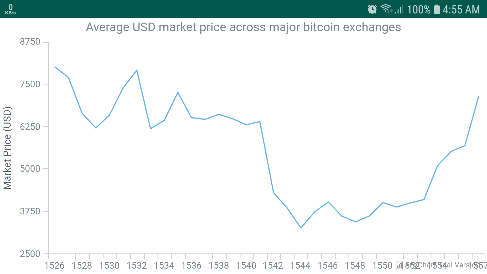
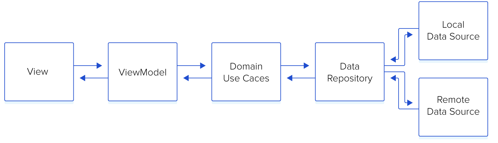

[](https://travis-ci.org/alynaguibv/BlockchainSampleApp)


## Block chain sample application 
 
### Description
Sample application to fetch and display average USD market price across major bitcoin exchanges. 




### Architecture overview

- The sample is implemented using (MVVM + Clean Architecture), each module is implemented as a standalone component then get included into the main application.



#### MVVM — Model View ViewModel
- MVVM is one of the (clean) architectures that achieves separation of concerns.

#### Presentation layer - ViewModel 
- ViewModels shouldn’t know anything about Android. This improves testability, leak safety and modularity. A general rule of thumb is to make sure there are no android.*

#### Domain Layer
- Business rules here: all the logic happens in this layer. Regarding the android project, you will see all the interactors (use cases) implementations here as well.

#### Repository Layer
- Repository is an abstraction layer, where you set a contract to be implemented later by the data sources whether these data sources are local data sources or remote data sources.

### How to run the sample application locally

- Preconditions: 
1. Android SDK API level 28 is installed. for more information please refer to http://www.androiddocs.com/sdk/installing/index.html
2. You have an Android Emulator/ Device to run the application.
3. To create/ download an Android Virtual Device please refer to https://developer.android.com/studio/run/managing-avds
4. "unzip" utility to be installed.

- Steps: 
1. Download the repository folder.
2. Open terminal window then execute the following commands:
```shell
unzip BlockchainSampleApp.zip
cd BlockchainSampleApp
./gradlew assembleDevDebug
adb install -t -r "app/build/outputs/apk/dev/debug/app-dev-debug.apk"
adb shell am start -n app.sample.blockchainsampleapp/.blockchainstats.ui.BlockchainStatsActivity
```